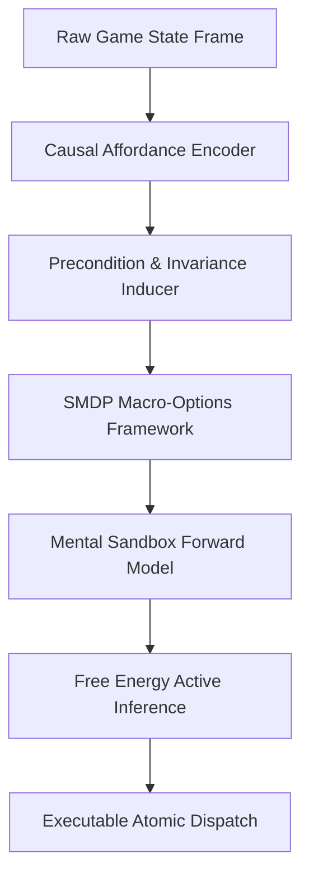

# ARC-AGI-3 SOVEREIGN CAUSAL SOLVER

[](https://www.gnu.org/licenses/agpl-3.0)
[](#)
[](#)

An autonomous, domain-agnostic causal solver designed for François Chollet's **ARC-AGI-3 Challenge** (`arc-prize-2026-arc-agi-3`).

Unlike statistical LLMs or rigid pattern-matching heuristics that hallucinate under novel rulesets, this solver constructs **explicit, verified causal world models** in continuous mental sandboxes using **Active Inference**, **Affordance Encoders**, and **discrete PSPACE graph search**.

---

## 🧠 Core Architecture



### 1. Causal Affordance Detection & Connected-Component Centroids
- Discovers functional entity boundaries and invariance rules directly from dynamic grid transitions.
- Tracks kinematic velocities, color palettes, and topological transformations across temporal state sequences.

### 2. Semi-Markov Decision Process (SMDP) Options
- Automatically abstracts low-level discrete keypresses into high-level macro-actions (navigation, containment, obstacle bypass, topological alignment).
- Prunes the infinite combinatorial search space down to verifiable affordance trajectories.

### 3. PSPACE Mental Sandbox & Hypothesis Induction
- Validates candidate policies inside an internal forward model before committing live actions.
- Automatically discards non-convergent strategies without wasting game environment lives.

### 4. Fully Offline Kaggle Kernel Pipeline
- Self-contained zero-internet submission package (`arc3_submission_kernel.py`).
- Embedded payload and offline dependency resolver running strictly within Kaggle's 12-hour evaluation budget.

---

## 📁 Repository Structure

```
├── auratic_core/
│   └── causal_engine/          # Active Inference & Forward State-Space Engine
├── causal_tool_selector/       # Affordance Encoders, Hypothesis Inducers & SMDP Options
│   ├── affordance_encoder.py
│   ├── causal_precondition_inducer.py
│   ├── options_framework.py
│   ├── mental_sandbox.py
│   └── platformer_planner.py
├── my_agent.py                 # SovereignARC3Agent Implementation
├── legacy_world_models.py      # World Model Fallback Battery
├── arc3_submission_kernel.py   # Standalone Kaggle Offline Submission Runner
└── README.md
```

---

## 🚀 Execution & Verification

### Running the Submission Kernel
```bash
python3 arc3_submission_kernel.py
```

### Inspecting the Agent Harness
```python
from my_agent import SovereignARC3Agent

agent = SovereignARC3Agent()
# Connects to ARC-AGI-3 Gym / Arcade Environment
```

---

## 🔒 License

GNU Affero General Public License v3.0 (AGPLv3). See [LICENSE](LICENSE).
