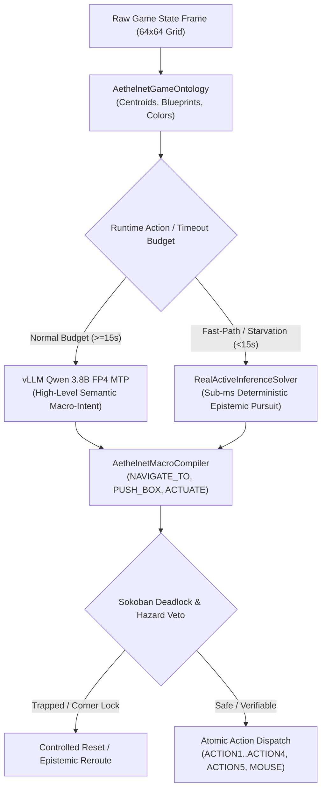

# ARC-AGI-3 SOVEREIGN NEUROSYMBOLIC CAUSAL SOLVER

[](https://www.gnu.org/licenses/agpl-3.0)
[](https://www.kaggle.com/competitions/arc-prize-2026-arc-agi-3)
[](#)
[](#)

An autonomous, domain-agnostic causal solver designed for François Chollet's **ARC-AGI-3 Challenge** (`arc-prize-2026-arc-agi-3`).

Unlike statistical LLMs or rigid pattern-matching heuristics that hallucinate under novel rulesets, this solver combines **high-level semantic reasoning** (vLLM Qwen 3.8B FP4 MTP) with a **deterministic Active Inference & Macro-Action Intent Compiler** and **discrete PSPACE graph search**.

---

## 🧠 Dual-Policy Architecture (Version 43)



### 1. Semantic Intent Formulation (vLLM Qwen 3.8B FP4 MTP)
- Ingests structured entity ontologies, foveated radars, and candidate actuator affordances.
- Generates high-level macro-intents (`NAVIGATE_TO`, `PUSH_BOX`, `ACTUATE_SWITCH`, `INTERACT`) instead of atomic single steps.
- Compresses LLM inference calls from ~220 calls/game to ~10–15 calls/game, eliminating evaluation timeout walls and GPU queue starvation.

### 2. AethelnetMacroCompiler (Kinematic & Deadlock Verification)
- Compiles high-level intents into optimal atomic action sequences using A* grid pathfinding.
- Computes exact Sokoban push offsets and stand-behind navigation coordinates.
- **Corner Deadlock Veto Gate**: Evaluates candidate pushes against immovable geometry, preventing fatal corner traps before committing moves to the environment.

### 3. RealActiveInferenceSolver (Sub-Millisecond Deterministic Fallback)
- Fully self-contained, 100% domain-agnostic active inference solver.
- Operates in $<1\text{ ms}$ per decision cycle when network latency or per-level quotas require instantaneous fallback.
- Batches multi-step navigational plans (up to 5 actions per batch) for accelerated execution.

### 4. Causal Transition & State-Space Engine (`auratic_core/causal_engine`)
- Maintains latent epistemic states and forward transition models ($\mathcal{S} \times \mathcal{A} \to \mathcal{S}'$).
- Quantifies free-energy gradients and prediction error to drive active exploration of unvisited mechanics.

---

## 📁 Repository Structure

```
├── auratic_core/
│   └── causal_engine/              # Causal Transition Models, Latent States & Active Inference
│       ├── active_inference.py
│       ├── forward_model.py
│       └── state_space.py
├── kaggle_arc/
│   ├── aethelnet_dsl.py            # Master Neurosymbolic DSL, Macro Compiler & Game Ontology
│   ├── real_active_inference_solver.py # Sub-ms Deterministic Active Inference Solver
│   ├── build_hybrid_notebook.py    # Kaggle Submission Notebook Assembler (v43)
│   ├── test_local_macro.py         # Offline Gym Test Runner for Macro Actions
│   ├── arc3_submission_kernel.py   # Standalone Kaggle Offline Submission Runner
│   ├── my_agent.py                 # Sovereign ARC-3 Agent Implementation Adapter
│   └── kernel-metadata.json        # Kaggle Kernel Deployment Metadata
├── tests/
│   ├── test_arc3_deadlock_nogood.py  # Deadlock Detection & Nogood Vault Tests
│   ├── test_arc3_foveated_patch.py   # Foveated Radar & Kinematics Tests
│   ├── test_arc3_game_ontology.py    # Ontological Entity Extraction & Affordance Tests
│   ├── test_arc3_macro_intent.py     # Macro Intent Compilation & Stride Tests
│   └── test_causal_engine.py         # Closed-Loop Active Inference Unit Tests
├── pyproject.toml
├── pytest.ini
├── LICENSE
└── README.md
```

---

## 🚀 Verification & Testing

### Running the Test Suite
The entire test harness runs without internet access and executes in $<1\text{ second}$:

```bash
pytest -v
```

All 24 test suites must pass 100% green before any release or competition push:
- `test_arc3_deadlock_nogood`: Corner trap vetoes, push deadlock evaluation, nogood memory injection.
- `test_arc3_foveated_patch`: Foveated radar rendering, step move simulation, velocity tracking.
- `test_arc3_game_ontology`: Actuator affordances, entity blueprints, slot-cargo matching.
- `test_arc3_macro_intent`: A* corridor navigation, safe box pushing, deadlock veto, mouse actions.
- `test_causal_engine`: Latent state encoding, forward transition learning, active inference control loops.

### Running Offline Local Puzzles
Test high-level macro policies against local ARC-AGI-3 offline games:

```bash
python3 kaggle_arc/test_local_macro.py wa30 symbolic
```

---

## 🔒 License

GNU Affero General Public License v3.0 (AGPLv3). See [LICENSE](LICENSE).
